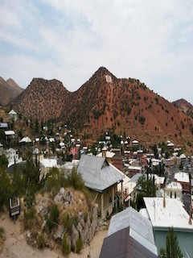
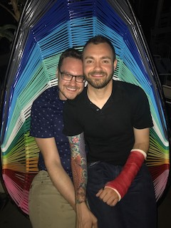
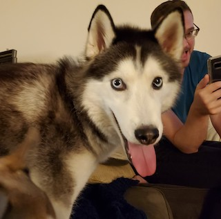
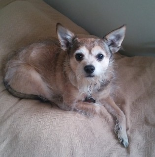

<!DOCTYPE html>
<html lang="en">
    <head>
        <meta charset="UTF-8">
        <link rel="stylesheet" href="styles.css">
        <title>About Me</title>
    </head>
    <body>
        

            <section class="intro">
                <h1>ABOUT ME</h1>
                

                    
                

                

                    
My name is Steve and thank you for visiting my about me page. I have been living in Seattle since 2014 and currently live with my partner Jared and our 2 pets Otis and Gizmo.

                    
As of now I work as an Ophthalmic Technician in a hospital assisting resident Ophthalmologists finish their training. As much as I've appreciated all this job has given me, I've decided it's time for a change.

                    
I am currently attending Seattle Central College to try to become a Web Developer!

                

            </section>
            <section class="mtos">
                <h1>AZ TO WASHINGTON</h1>
                

                    

                    

                    

                

                

                    
I was originally born in Minneapolis, Minnesota on August 23rd 1986. Due to some misfortunate events my mom decided to pack up and head out to Bisbee, Arizona. I was very fortunate to grow up in Bisbee, it is a very unique town that originally was a mining town turned tourist/hippie haven.

                    
Eventually my mom decided it was time for a change and we moved to Sierra Vista, AZ. Sierra Vista is a military town that has the historic base called <em>Fort Huachuca</em>. Sierra Vista has more to offer in terms of jobs and education, but lacked the charm that Bisbee does. In my early 20s I felt the need for something more meaningful in my life I decided to move to Tucson, Arizona.

                    
Tucson was the next best place to live in comparison to Bisbee for me. I was able to grow a lot in Tucson after various trials in regards to work, relationships and friendships. It was in Tucson that I was able to get a job in an optical chain called <em>Nationwide Vision</em>, ironically it was not nationwide. After a messy break up from a relationship of 5 years I decided I had enough of Arizona and moved on to Seattle, Washington.

                    
Seattle was again another place of growing and developement for me. I was able to experience a lot of new things here and become a more mature person through further trials. I eventually took a plunge into a new position in Ophthalmology instead of Optometry <strong><u><em>(Optometry = glasses and contact lenses and Ophthalmology = Treatment and Surgery, it case you were confused.)</em></u></strong>

                    
After a few years of dating experiences I was extremely lucky to meet my amazing partner Jared. We currently live Seattle proper near the <em>Space Needle</em>.

                

            </section>
            <section class="pets">
                <h1>PETS</h1>
                

                    

                    

                

                

                    <ul>
                        <li><strong><u>PICTURED LEFT</strong></u>: Gizmo is currently 3 years old. He is a 3 legged Husky mix whom has a lot of energy. He also has a quirky underbite. Gizmo came to use from an animal shelter. The shelter believed that Gizmo was a result of an unresponsible breeder trying to create a minature Husky. He was found on the streets with a disfigured back leg that required a handful. But don't feel too bad! He is quite the handful with only 3 legs.</li>
                     
                        <li><strong><u>PICTURED RIGHT</strong></u>: Otis is my little old man and he is 13.5 years old. Otis is a Terrier/Chinese Crested mix and is pretty relaxed. Otis spends most of his time napping. He came to me when I was living in Arizona when I was 23 years old. He went through a few different owners prior to finding a home with me. I don't know how I would have fared without Otis by my side when I first moved to Seattle.</li>
                    </ul>
                

            </section>
            <section class="interests">
                <h1>INTERESTS</h1>
                

                    <ul>
                        <li><strong><u>VIDEO GAMES</u></strong>: I've always had a strong interest in videogames since a very young age. I typically prefer RPGs(Role Playing Games) and tactical type games.</li>
                     
                        <li><strong><u>READING</u></strong>: I really became interested in reading around High School, but unfortunately haven't been able to read for enjoyment much these days. I typically enjoy reading Fiction, but lately have enjoyed reading informational Non-Fiction books.</li>
                     
                        <li><strong><u>BOARD GAMES</u></strong>: I wasn't a very big fan of board games during my childhood, but Jared has helped change that. Jared and I will typically play one on one, but we really like having friends over for group games. One of our favorite games is "Villainous" by Disney.</li>
                    </ul>
                

            </section>
        

    </body>
</html>
